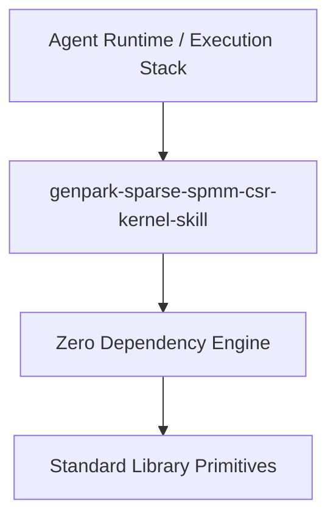

# genpark-sparse-spmm-csr-kernel-skill

[](https://github.com/Alpha-Park/genpark-sparse-spmm-csr-kernel-skill)
[](https://github.com/Alpha-Park/genpark-sparse-spmm-csr-kernel-skill)
[](https://www.python.org/)

Compressed Sparse Row (CSR) Sparse Matrix-Dense Matrix Multiplication (SpMM) acceleration kernel with row-pointer parallelism and load-balanced binning.



## Features
- **Strict 0 Pip Dependencies**: Built completely using the Python Standard Library.
- **Fast Execution & Verification**: Includes client wrapper, MCP server, and verified test suites.
- **Agentic AI Ready**: Exposes standard MCP tools for continuous LLM integration.

## Installation & Quickstart
```bash
git clone https://github.com/Alpha-Park/genpark-sparse-spmm-csr-kernel-skill.git
cd genpark-sparse-spmm-csr-kernel-skill
python example_usage.py
```
